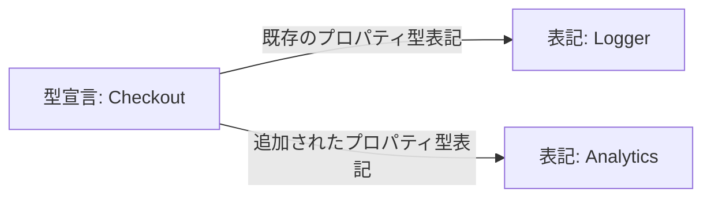

# 同じ観測を図で読む試作

**図を追加する場合は、共通の観測データから描き、矢印が何を意味するかを明示する。**

ユーザーのMermaid案を、既存のLogger固定入力で試す。これは手作業の表示案であり、Mermaidを生成するCLIオプションはまだ実装していない。JSON/CLIを中心に据えたまま、図を出力形式の一つにすることを検討する。

## Logger例

[固定入力](../../Fixtures/design-review/cases.json)では、CheckoutにLogger型のプロパティが既にあり、Analytics型のプロパティを追加する。現在のcompactは追加表記と共通表記を持つ。次の図はその関係だけを描く。

右側のノードは解決済みの型宣言ではなく型表記。同名の型へ結び付けたり、LoggerとAnalyticsの間に関連の線を足したりしない。統一窓口がよいか、同意管理のため分離すべきかという方針差は、この図では分からない。

## textとの違い

図では既存と追加を一緒に見る配置が分かりやすい。一方、この小さな例ならtextの`+ Analytics`と`= Logger`でも同じ事実を読める。図にしただけで新しい情報が得られるわけではない。項目が増えると読みづらくなるため、全アプリの巨大な図を標準出力にしない。

## 実装する場合の構成案

解析した観測を共通データにし、text・JSON・Mermaidの各レンダラーが読む。PRコメント、ローカルMarkdown、AIへのJSONは利用先であり、解析の前提にはしない。CLIからMermaidのテキストをファイルへ保存する方式なら画像レンダリングやブラウザを実行要件にせずに済む。

型表記の集合だけでは矢印の役割（プロパティ/引数/戻り値）が欠ける場合がある。生成版では既に保持するReferenceのroleと位置を使い、今回の手作業のラベルを名前から推測しない。ノードIDの安定性、引用符等のescape、件数制限と省略の明示、追加/削除/既存の凡例、レイアウトに依存しない元データを先に決める。

## 現在の判断

JSON/CLIとの両立に根本的な障害はない。ただしPR専用の飾りとして追加せず、同じ観測を別の読み方で提供する候補にする。生成機能は未採用。次の独立比較ではまずtextの文脈追加を確かめ、図の効果と同時に混ぜて評価しない。
